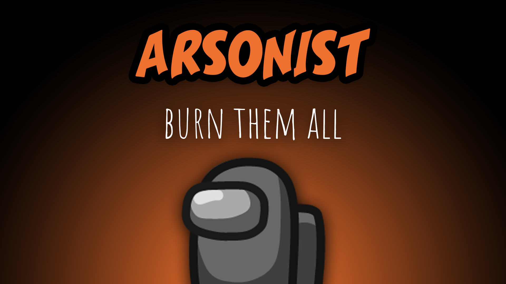

[:arrow_backward: back to overview](https://github.com/laicosvk/theepicroles#roles "back to overview")

# Arsonist (Neutral)
Burn them all!

The Arsonist doesn't have any tasks, they have to win the game alone.
The Arsonist must douse other players by holding the douse button next to a player for a few seconds.
After dousing all living players, the Arsonist can ignite all players which results in an Arsonist win.

## Notes
- If the player that the Arsonist douses walks out of range, the cooldown will reset to 0.

## Buttons
| Douse Button | Ignite Button |
| :------------: | :------------: |
|||

## Options
| Name | Default | Description |
| --- | :---: | --- |
| Arsonist Countdown | 12.5 | Initial mark cooldown |
| Douse Duration | 3 | The time it takes to douse a player |