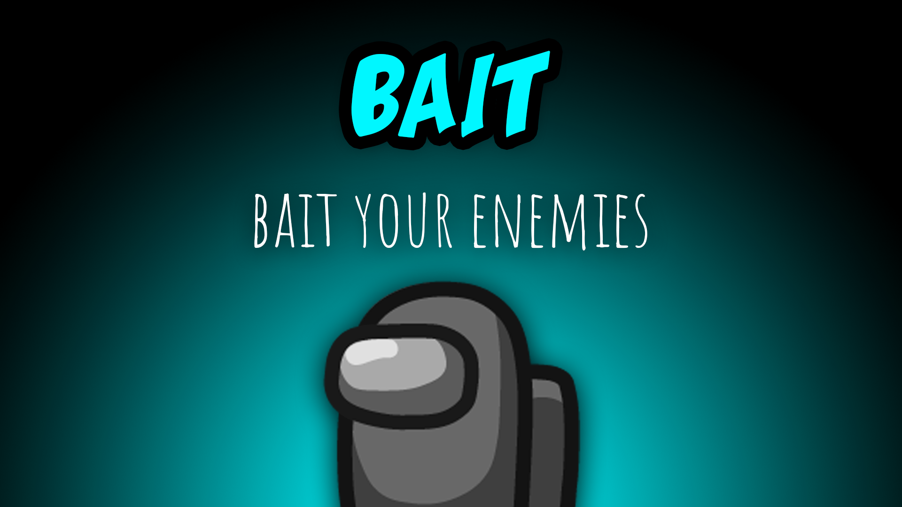

[:arrow_backward: back to overview](https://github.com/laicosvk/theepicroles#roles "back to overview")

# Bait (Crewmate)
Bait your enemies

The Bait is a Crewmate that if killed, forces the killer to self report the body. 

## Notes
- The Bait can see if someone is inside a vent (depending on the options the exact vent gets an outline or all vents do).

## Buttons
No special buttons.

## Options
| Name | Default | Description |
| --- | :---: | --- |
| Highlight All Vents If A Vent Is Occupied | off | On: All vents will be highlighted if a player is inside of one of them. Off: Only the vents where players are siting in will be highlighted. |
| Bait Report Delay | 0 | - |
| Warn The Killer With A Flash | on | - |

