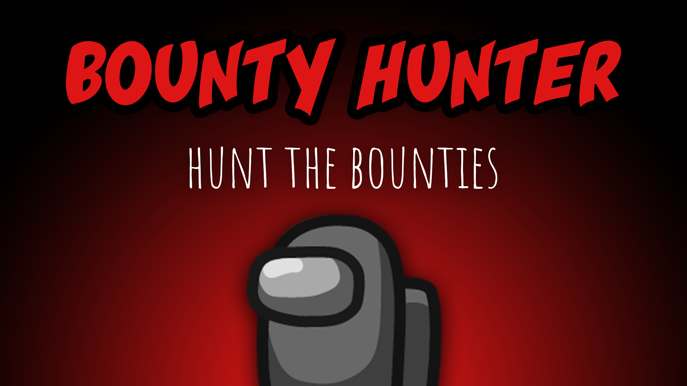

[:arrow_backward: back to overview](https://github.com/laicosvk/theepicroles#roles "back to overview")

# Bounty Hunter (Impostor)
Hunt the bounties

The Bounty Hunter gets bounties (the bounty player doesn't get notified) to kill.
The target of the Bounty Hunter changes after every meeting and after a preselected amount of time.
If the Bounty Hunter kills their target, their kill cooldown will be a lot less than usual.
Otherwise killing a player that's not their current target will increase the kill cooldown.
Depending on the options, there'll be an arrow pointing towards the current target.

## Notes
- The target won't be an Impostor, a Spy or the Bounty Hunter's Lover.
- Killing the target resets the timer and a new target will be selected.

## Buttons
No special buttons.

## Options
| Name | Default | Description |
| --- | :---: | --- |
| Duration After Which Bounty Changes | 60 | - |
| Cooldown After Killing Bounty | 2.5 | - |
| Additional Cooldown After Killing Others | 20 | Time will be added to the normal impostor cooldown if the Bounty Hunter kills a not-bounty player |
| Show Arrow Pointing Towards The Bounty | on | If set to true an arrow will appear (only visiable for the Bounty Hunter) |
| Bounty Hunter Arrow Update Interval | 5 | Sets how often the position is being updated |
