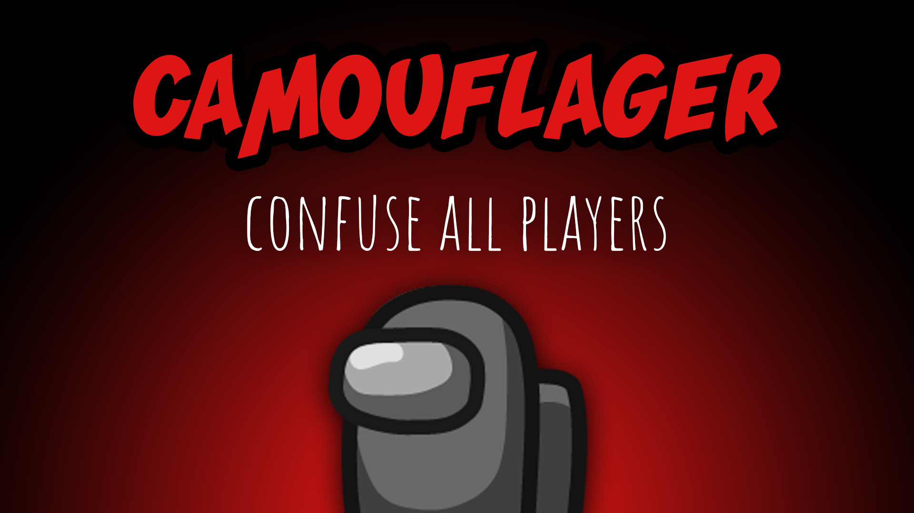

[:arrow_backward: back to overview](https://github.com/laicosvk/theepicroles#roles "back to overview")

# Camouflager (Impostor)
Confuse all players

The Camouflager can additionally activate a camouflage mode. The camouflage mode lasts for 10s and while it is active, all player names/pets/hats are hidden and all players have the same color.

## Notes
- The Mini will look like all the other players.
- The color of the footprints turns gray (also the ones that were already on the ground).
- The Hacker sees gray icons on the admin table
- The shield is not visible anymore
- Tracker and Snitch arrows keep working

## Buttons
| Camo Button |
| :------------: |
|  |

## Options
| Name | Default | Description |
| --- | :---: | --- |
| Camouflager Cooldown | 30 | - |
| Camo Duration | 10 | Time players stay camouflaged |
