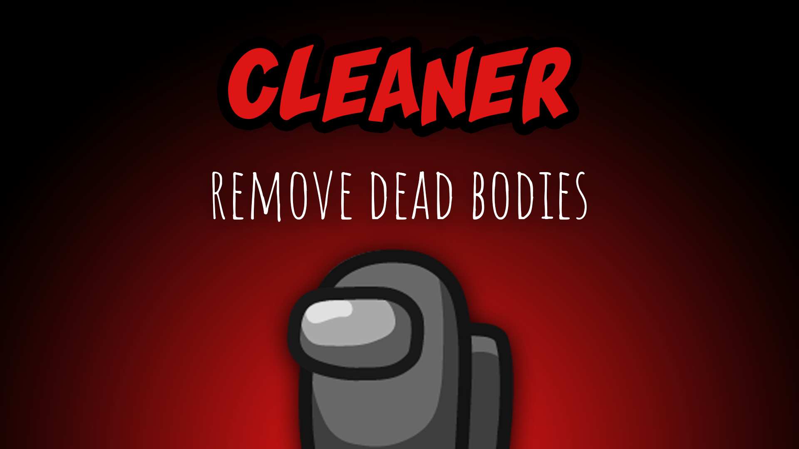

[:arrow_backward: back to overview](https://github.com/laicosvk/theepicroles#roles "back to overview")

# Cleaner (Impostor)
Clean & Kill

The Cleaner has the extra ability to clean dead bodys and remove them entirely from the map. Beside this he can kill like a normal impostor. Dont get confused with the Vulture. :-)

## Notes
- Clean- and Kill-Buttons are conntected to each other. They set each others cooldowns to the specified time.
- If there is a Cleaner in the game, there can't be a Vulture.

## Buttons
| Clean Button |
| :------------: |
|  |

## Options
| Name | Default | Description |
| --- | :---: | --- |
| Cleaner Cooldown | 30 | Initial cleaning cooldown |
