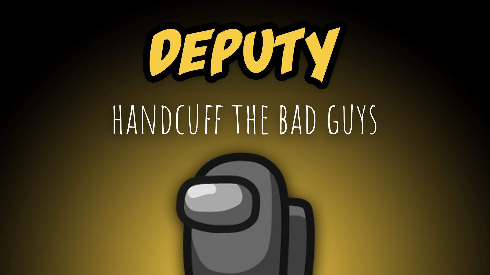

[:arrow_backward: back to overview](https://github.com/laicosvk/theepicroles#roles "back to overview")

# Deputy (Crewmate)
Handcuff the bad guys

The Deputy has the ability to handcuff player. Handcuffs will be hidden until the handcuffed player try to use a disabled button/hotkey. 

Handcuffs disable:
- Kill
- Abilities
- Vent
- Report

## Notes
- Duration starts after the handcuffs become visible.
- Deputy can not be in game without Sheriff.

## Buttons
| Handcuff Button | Handcuffed Button |
| :------------: | :------------: |
|  |  |

## Options
| Name | Default | Description |
| --- | :---: | --- |
| Deputy Number Of Handcuffs | 3 | - |
| Handcuff Cooldown | 30 | - |
| Handcuff Duration | 15 | - |
| Sheriff And Deputy Know Each Other | on | - |
| Deputy Gets Promoted To Sheriff | off | - |
| Deputy Keeps Handcuffs When Promoted | on | - |

