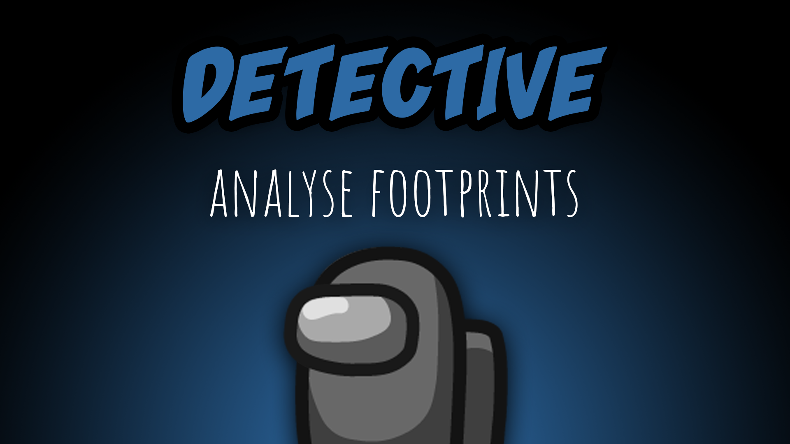

[:arrow_backward: back to overview](https://github.com/laicosvk/theepicroles#roles "back to overview")

# Detective (Crewmate)
Analyse footprints

The Detective can see footprints that other players leave behind. The Detective's other feature shows when they report a corpse: they receive clues about the killer's identity. 
The type of information they get is based on the time it took them to find the corpse.

## Notes
- When people change their colors (because of a morph or camouflage), all the footprints also change their colors (also the ones that were already on the ground). If the effects are over, all footprints switch back to the original color.
- The Detective does not see footprints of players that sit in vents
- During the meetings you can see, whether a player wears a darker or a lighter color, represented by (D) or (L) in the names.

## Buttons
No special buttons.

## Options
| Name | Default | Description |
| --- | :---: | --- |
| Anonymous Footprints | off | - |
| Footprint Intervall | 0.5 | - |
| Footprint Duration | 5 | - |
| Time Where Detective Reports Will Have Name | 0 | Time to report to see the killers name |
| Time Where Detective Reports Will Have Color Type | 20 | Time to report to see the killers color |

