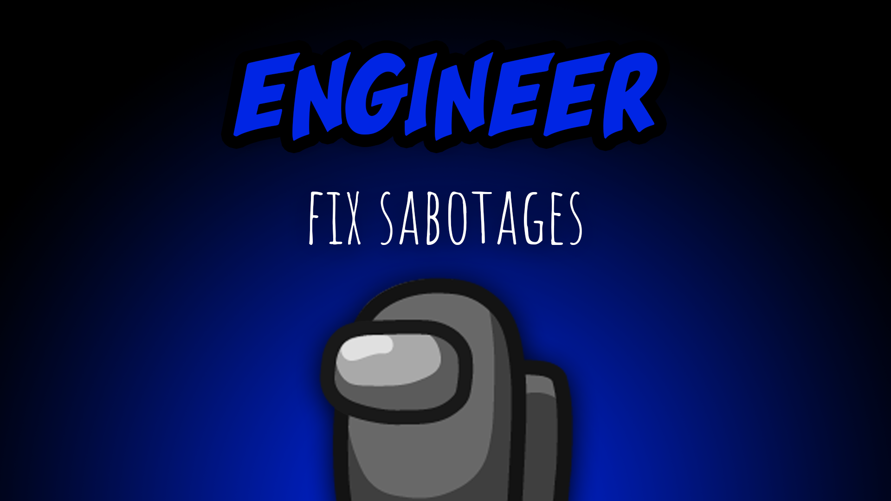

[:arrow_backward: back to overview](https://github.com/laicosvk/theepicroles#roles "back to overview")

# Engineer (Crewmate)
Fix sabotages

The Engineer (if alive) can fix a certain amount of sabotages per game from anywhere on the map.
The Engineer can use vents.
If the Engineer is inside a vent, depending on the options the members of the team Jackal/Impostors will see a blue outline around all vents on the map (in order to warn them).

## Notes
- The kill button of Impostors activates if they stand next to a vent where the Engineer is. They can also kill them there. No other action (e.g. Morphling sample, Shifter shift, ...) can affect players inside vents.
- Because of the vents the Engineer might not be able to start some tasks using the "Use" button, you can double-click on the tasks instead.

## Buttons
| Repair Button |
| :------------: |
| |

## Options
| Name | Default | Description |
| --- | :---: | --- |
| Number Of Sabotage Fixes | 1 | - |
| Impostors See Vents Highlighted | on | - |
| Jackal and Sidekick See Vents Highlighted | on | - |