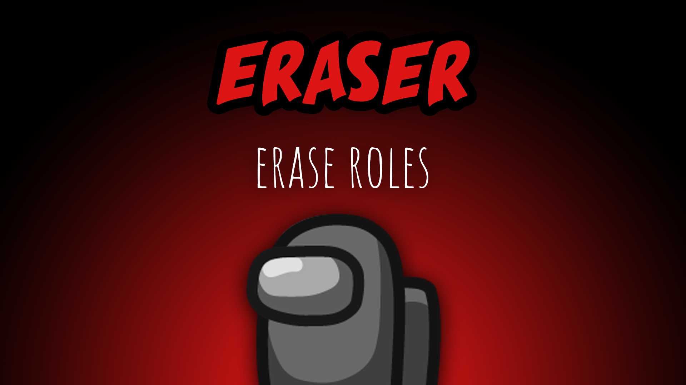

[:arrow_backward: back to overview](https://github.com/laicosvk/theepicroles#roles "back to overview")

# Eraser (Impostor)
Erase roles

The Eraser can erase the role of players. The targeted players will lose their role after the meeting right before a player is exiled.
After every erase, the cooldown increases by 10 seconds. The erase will be performed, even if the Eraser or their target die before the next meeting.
By default the Eraser can erase everyone but the Spy and other Impostors. Depending on the options they can also erase them (Impostors will lose their special Impostor ability).

## Notes
- The Shifter shift will always be triggered before the Erase (hence either the new role of the Shifter will be erased or the Shifter saves the role of their target, depending on whom the Eraser erased)
- Erasing a Lover automatically erases the other Lover as well (if the second Lover is an ImpLover, they will turn into an Impostor)
- Erasing a Jackal that has a Sidekick, triggers the Sidekick promotion if it's activated in the settings
- As the erase is being triggered before the ejection of a player, erasing and voting out a Lover in the same round, would result in the ex-Lover surviving, as the partnership was erased before. Also a Jester win would not happen, as the erase will be triggered before.

## Buttons
| Erase Button |
| :------------: |
|  |

## Options
| Name | Default | Description |
| --- | :---: | --- |
| Eraser Cooldown | 30 | The Eraser's cooldown will increase by 10 seconds after every erase |
| Eraser Can Erase Anyone | off | If set to false, they can't erase the Spy and other Impostors |
