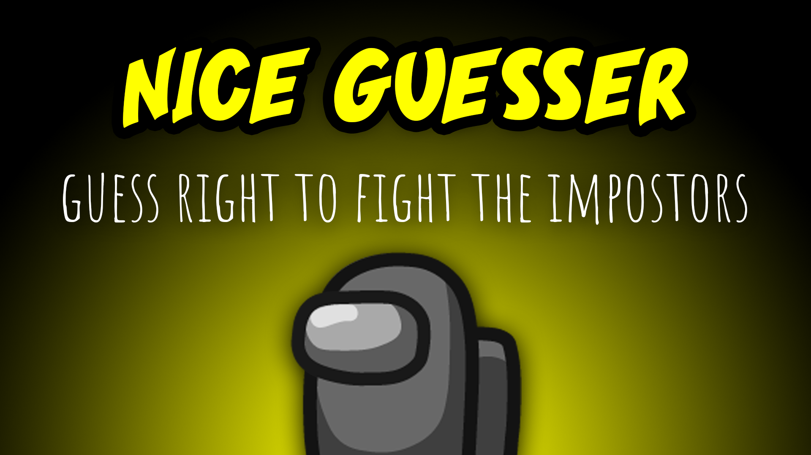
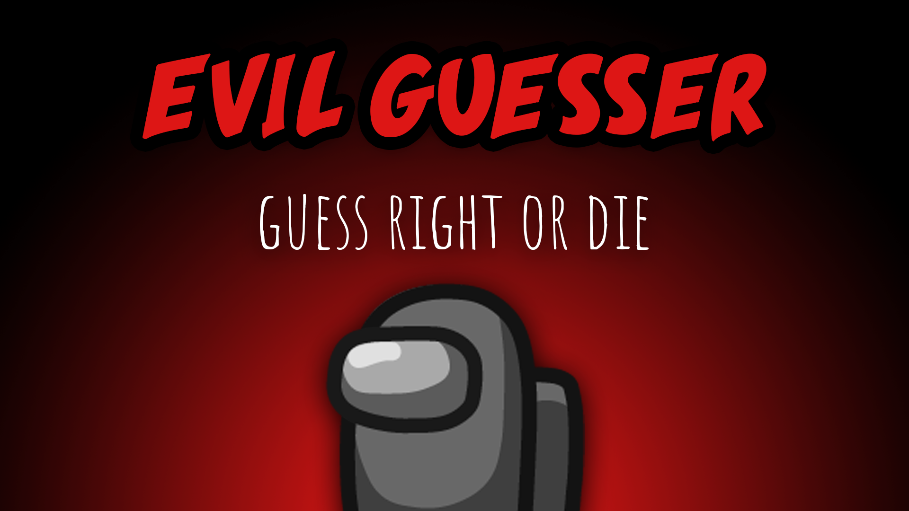

[:arrow_backward: back to overview](https://github.com/laicosvk/theepicroles#roles "back to overview")

# Guesser
Guess right or die

The Guesser can be a Crewmate or an Impostor (depending on the settings).
The Guesser can shoot players during the meeting, by guessing its role. If the guess is wrong, the Guesser dies instead.
You can select how many players can be shot per game and if multiple players can be shot during a single meeting.
The guesses Impostor and Crewmate are only right, if the player is part of the corresponding team and has no special role.
You can only shoot during the voting time.
Depending on the options, the Guesser can't guess the shielded player and depending on the Medic options the Medic/shielded player might be notified (no one will die, independently of what the Guesser guessed).

## Nice Guesser (Crewmate)
Guess the bad guys

## Evil Guesser (Impostor)
Guess the good guys

## Notes
- If a player gets shot, you'll get back your votes
- You can't guess the role Nice Mini for obvious reasons
- You can't guess the role Lover, you'll have to guess the primary role of one of the Lovers, to kill both of them
- Jester wins won't be triggered, if the Guesser shoots the Jester before the Jester gets voted out

## Buttons
| Meeting Target Button |
| :------------: |
|  |

## Options
| Name | Default | Description |
| --- | :---: | --- |
| Chance That The Guesser Is An Impostor | 0 | - |
| Guesser Number Of Shots | 2 | - |
| Guesser Can Shoot Multiple Times Per Meeting | off | - |
| Guesses Visible\nIn Ghost Chat | on | - |
| Guesses Ignore\nThe Medic Shield | on | - |
| Evil Guesser\nCan Guess The Spy | on | - |
| Both Guesser Spawn Rate | 0 | - |
| Guesser Can't Guess Snitch When Tasks Completed | on | - |

