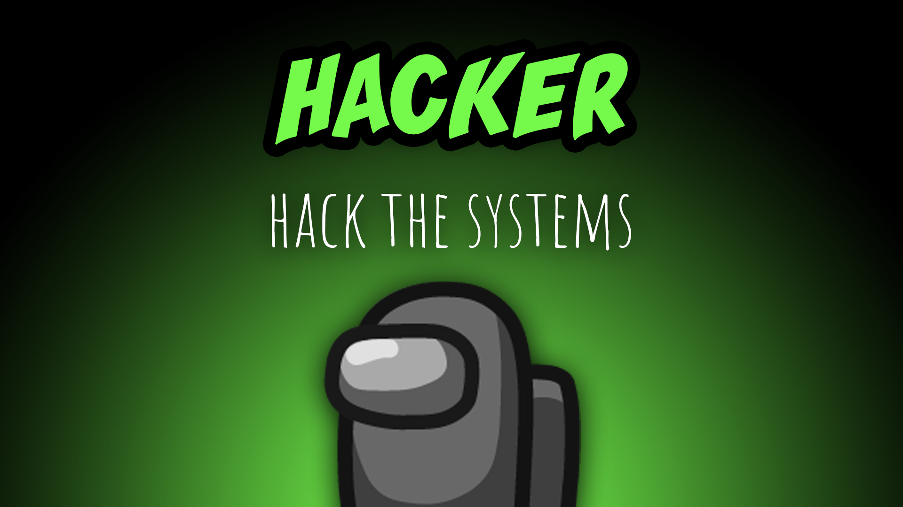

[:arrow_backward: back to overview](https://github.com/laicosvk/theepicroles#roles "back to overview")

# Hacker (Crewmate)
Hack the systems

If the Hacker activates the "Hacker mode", the Hacker gets more information than others from the admin table and vitals for a set duration.
Otherwise they see the same information as everyone else. Admin table: The Hacker can see the colors (or color types) of the players on the table.
Vitals: The Hacker can see how long dead players have been dead for.
The Hacker can access his mobile gadgets (vitals & admin table), with a maximum of charges (uses) and a configurable amount of tasks needed to recharge.
While accessing those mobile gadgets, the Hacker is not able to move.

## Notes
- If the Morphling morphs or the Camouflager camouflages, the colors on the admin table change accordingly
- During the meetings you can see, whether a player wears a darker or a lighter color, represented by (D) or (L) in the names.

## Buttons
| Hack Button |
| :------------: |
|  |

## Options
| Name | Default | Description |
| --- | :---: | --- |
| Hacker Cooldown | 30 | - |
| Hacker Duration | 10 | - |
| Hacker Only Sees Color Type | off | - |
| Max Mobile Gadget Charges | 5 | - |
| Number Of Tasks Needed For Recharging | 2 | - |
| Cant Move During Mobile Gadget Duration | on | - |

