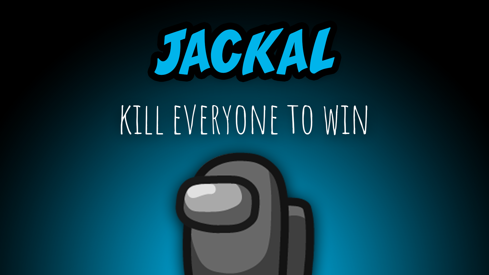

[:arrow_backward: back to overview](https://github.com/laicosvk/theepicroles#roles "back to overview")

# Jackal (Neutral)
Kill everyone to win

The Jackal is part of an extra team, that tries to eliminate all the other players.
The Jackal has no tasks and can kill Impostors, Crewmates and Neutrals.
The Jackal (if allowed by the options) can select another player to be their Sidekick. Creating a Sidekick removes all tasks of the Sidekick and adds them to the team Jackal. The Sidekick loses their current role (except if they're a Lover, then they play in two teams). The "Create Sidekick Action" may only be used once per Jackal or once per game (depending on the options). The Jackal can also promote Impostors to be their Sidekick but, depending on the options the Impostor will either really turn into the Sidekick and leave the team Impostors or they will just look like the Sidekick to the Jackal and remain as they were.

## Notes
- The Jackal (and their Sidekick) may be killed by a Sheriff.
- A Jackal cannot target the Mini, while it's growing up. After that they can kill it or select it as its Sidekick.
- The Crew can still win, even if all of their members are dead, if they finish their tasks fast enough (That's why converting the last Crewmate with tasks left into a Sidekick results in a task win for the crew.)
- If both Impostors and Jackals are in the game the game, continues even if all Crewmates are dead. Crewmates may still win in this case by completing their tasks. Jackal and Impostor have to kill each other.

## Buttons
| Sidekick Button |
| :------------: |
|  |

## Options
| Name | Default | Description |
| --- | :---: | --- |
| Jackal/Sidekick Kill Cooldown | 30 | - |
| Jackal Create\nSidekick Cooldown | 30 | - |
| Jackal Can Use Vents | on | - |
| Jackal Can Create A Sidekick | off | - |
| Sidekick Gets Promoted To Jackal On Jackal Death | off | - |
| Sidekick Can Kill | off | - |
| Sidekick Can Use Vents | on | - |
| Jackals Promoted From Sidekick Can Create A Sidekick | on | - |
| Jackals Can Make An Impostor To His Sidekick | on | - |
| Jackal And Sidekick Have Impostor Vision | off | - |

