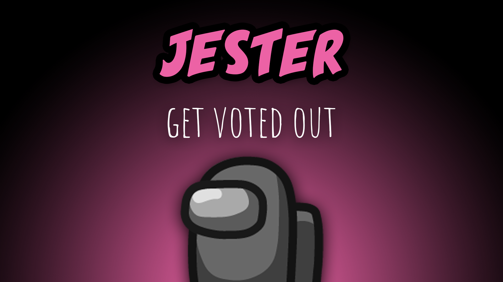

[:arrow_backward: back to overview](https://github.com/laicosvk/theepicroles#roles "back to overview")

# Jester (Neutral)
Get voted out

The Jester does not have any tasks. They win the game as a solo, if they get voted out during a meeting.

## Buttons
No special buttons.

## Options
| Name | Default | Description |
| --- | :---: | --- |
| Jester Can Call Emergency Meeting | on | - |
| Jester Has Impostor Vision | on | - |
| Jester Can Be Client Of Lawyer| off | - |