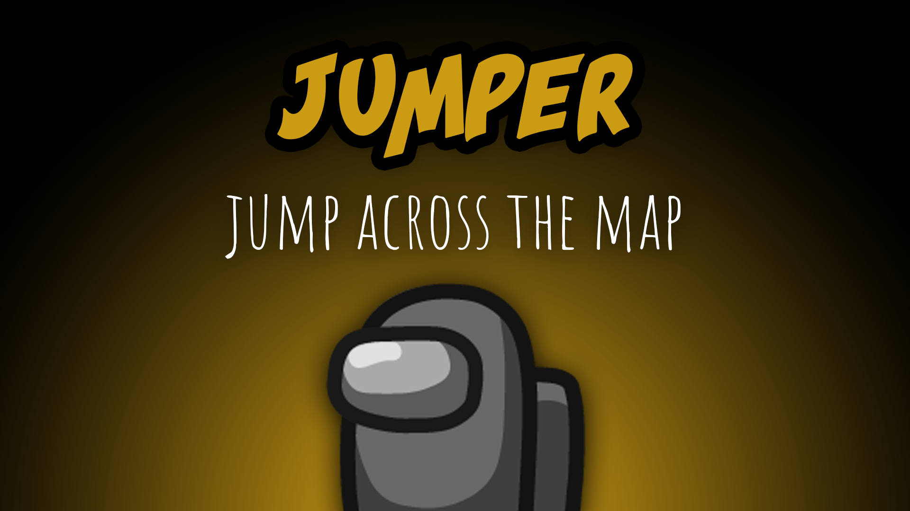
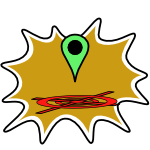

[:arrow_backward: back to overview](https://github.com/laicosvk/theepicroles#roles "back to overview")

# Jumper (Impostor)
Jump across the map

HIER BITTE BESCHREIBEN

## Notes
Every jump requires one charge. Charges are regained after each meeting.

## Buttons
| Mark Button | Jump Button |
| :------------: | :------------: |
|  |  |

## Options
| Name | Default | Description |
| --- | :---: | --- |
| Jump Cooldown | 30 | How long you have to wait after a meeting or a previous jump to jump again |
| Charges On Place | 1 | How many charges should the Jumper have after the position was marked |
| Charges Gained After Meeting | 2 | How many charges should the Jumper get after a meeting |
| Maximum Charges | 3 | The max. number of charges the Jumper can hold |
