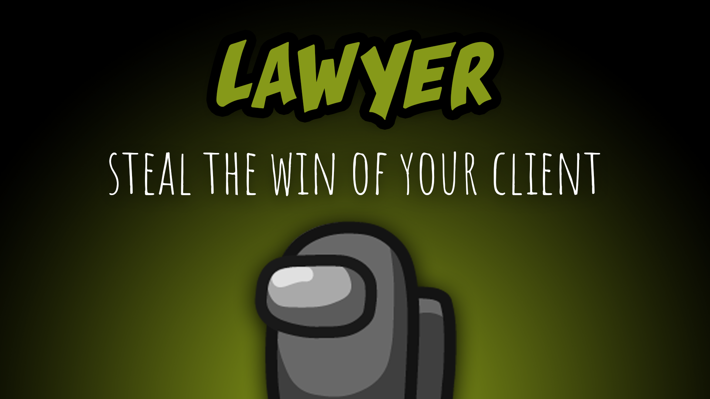

[:arrow_backward: back to overview](https://github.com/laicosvk/theepicroles#roles "back to overview")

# Lawyer (Neutral)
Steal the win of your client

The Lawyer is a neutral role that has a client. The client might be an Impostor or Jackal which is no Lover. 
The Lawyer needs their client to win in order to win the game. 
If their client dies or gets voted out, the Lawyer changes their role and becomes the Pursuer, which has a different goal to win the game. 
The main goal of the Lawyer is to win as Lawyer, as it is not allowed to betray their client.

The Lawyer can win in multiple ways:
- Lawyer dead, client alive and client team won: The Lawyer wins together with the team of the client
- Lawyer and client alive and client team won: The Lawyer wins with the team of the client. The client doesn't win (even if their Impostor/Team Jackal mate wins), the Lawyer steals their win. Hence the client should keep the Lawyer alive for some time, to get some help during the meetings, but has to eliminate them soon enough to not get their win stolen.

# Persuer (Neutral)
The Pursuer is still a neutral role, but has a different goal to win the game; they have to be alive when the game ends (no matter who causes the win). In order to achieve this goal, the Pursuer has an ability called "Blank", where they can fill a killers (this also includes the Sheriff) weapon with a blank. So, if the killer attempts to kill someone, the killer will miss their target, and their cooldowns will be triggered as usual. If the killer fires the "Blank", shields (e.g. Medic shield or Time Master shield) will not be triggered. The Pursuer has tasks (which can already be done while being a Lawyer), that count towards the task win for the Crewmates. If the Pursuer dies, their tasks won't be counted anymore.

## Notes
- If the client disconnects, the Lawyer will also turn into the Pursuer
- If "Lawyer Target Knows" is set to true, the client will know that someone is their Lawyer, but won't know who.

## Buttons
| Persuer Blank Button |
| :------------: |
|  |

## Options
| Name | Default | Description |
| --- | :---: | --- |
| Lawyer Target Knows | on | The target knows that it is the target (marked with "§", if the Lawyer dies, the mark will disappear) |
| Lawyer Wins After Meetings | off | On: The Lawyer wins after a configurable amount of meetings (can't start meetings himself) |
| Lawyer Needed Meetings To Win | 5 | - |
| Lawyer Vision | 1 | - |
| Lawyer Knows Target Role | off | - |
| Pursuer Blank Cooldown | 30 | - |
| Pursuer Number Of Blanks | 5 | - |