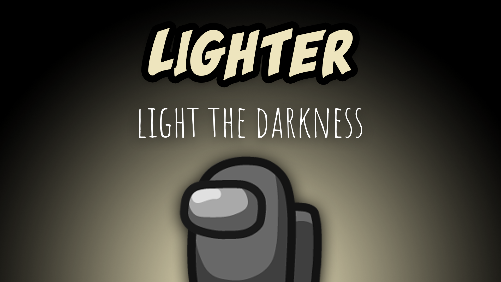

[:arrow_backward: back to overview](https://github.com/laicosvk/theepicroles#roles "back to overview")

# Lighter (Crewmate)
Light the darkness

The Lighter can turn on their Lighter every now and then, which increases their vision by a customizable amount.

## Buttons
| Light Button |
| :------------: |
|  |

## Options
| Name | Default | Description |
| --- | :---: | --- |
| Lighter Mode Vision On Lights On | 2 | The vision the Lighter has when the lights are on and the Lighter mode is on |
| Lighter Mode Vision\nOn Lights Off | 0.75 | The vision the Lighter has when the lights are down and the Lighter mode is on |
| Lighter Cooldown | 30 | - |
| Lighter Duration | 5 | - |