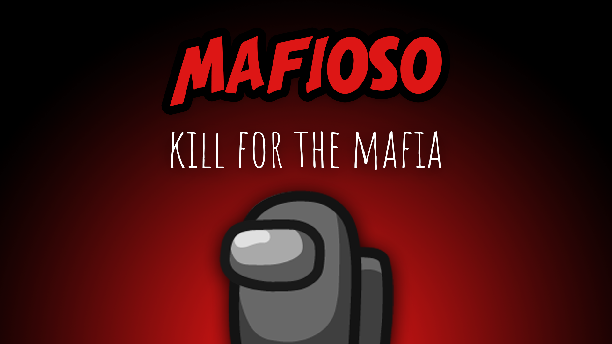

[:arrow_backward: back to overview](https://github.com/laicosvk/theepicroles#roles "back to overview")

# Mafia (Impostor)
A dream team

The Mafia are a group of three Impostors.
The Godfather works like a normal Impostor.
The Mafioso is an Impostor who cannot kill until the Godfather is dead.
The Janitor is an Impostor who cannot kill, but they can hide dead bodies instead.

## Notes
- There have to be 3 Impostors activated for the mafia to spawn.

## Buttons
| Janitor Clean Button |
| :------------: |
|  |

## Options
| Name | Default | Description |
| --- | :---: | --- |
| Janitor Cooldown | 30 | - |

