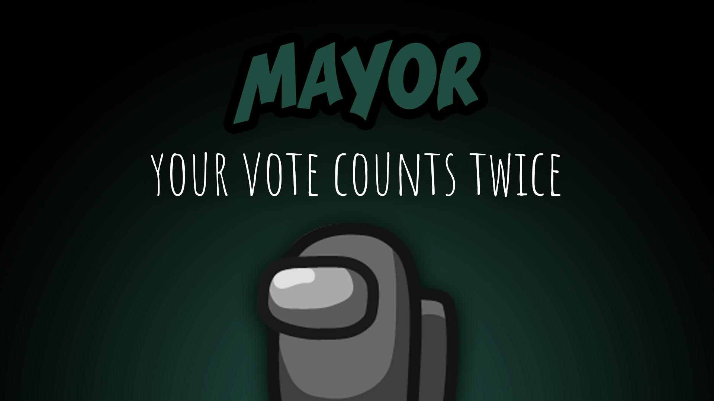

[:arrow_backward: back to overview](https://github.com/laicosvk/theepicroles#roles "back to overview")

# Mayor (Crewmate)
Your vote counts twice

The Mayor leads the Crewmates by having a vote that counts twice.
Optionally it only shows 1 vote but counts 2.
The Mayor can always use their meeting, even if the maximum number of meetings was reached.

## Buttons
No special buttons.

## Options
| Name | Default | Description |
| --- | :---: | --- |
| Show Mayor Votes | off | - |
