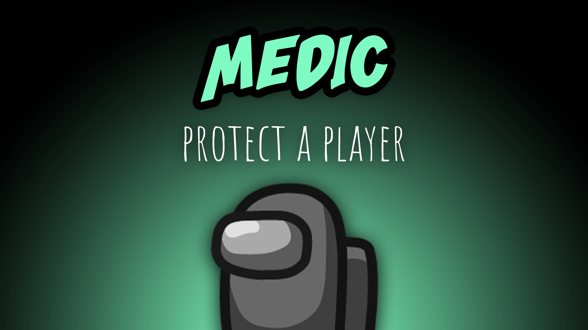

[:arrow_backward: back to overview](https://github.com/laicosvk/theepicroles#roles "back to overview")

# Medic (Crewmate)
Protect a player

The Medic can shield (highlighted by an outline around the player) one player per game, which makes the player unkillable.
The shielded player can still be voted out and might also be an Impostor.
If set in the options, the shielded player and/or the Medic will get a red flash on their screen if someone (Impostor, Sheriff, ...) tried to murder them. If the Medic dies, the shield disappears with them.
The Sheriff will not die if they try to kill a shielded Crewmate and won't perform a kill if they try to kill a shielded Impostor.
Depending on the options, guesses from the Guesser will be blocked by the shield and the shielded player/medic might be notified.
The Medic's other feature shows when they report a corpse: they will see how long ago the player died.

## Notes
- If the shielded player is a Lover and the other Lover dies, they nevertheless kill themselves.
- If the Shifter has a shield or their target has a Shield, the shielded player switches.
- Shields set after the next meeting, will be set before a possible shift is being performed.

## Buttons
| Shield Button |
| :------------: |
|  |

## Options
| Name | Default | Description |
| --- | :---: | --- |
| Show Shielded Player | Everyone | "Everyone", "Shielded + Medic", "Medic" |
| Shielded Player Sees Murder Attempt | off | - |
| Shield Will Be Set After The Next Meeting | off | - |
| Medic Sees Murder Attempt On Shielded Player | off | - |