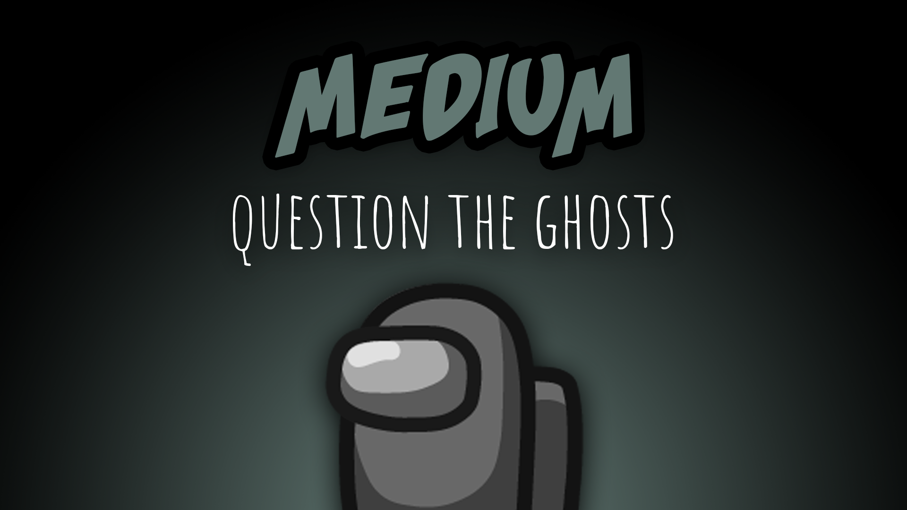

[:arrow_backward: back to overview](https://github.com/laicosvk/theepicroles#roles "back to overview")

# Medium (Crewmate)
Question the ghosts

The medium is a crewmate who can ask the souls of dead players for information. 
Like the Seer, it sees the places where the players have died (after the next meeting) and can question them. It then gets random information about the soul or the killer in the chat. 
The souls only stay for one round, i.e. until the next meeting. Depending on the options, the souls can only be questioned once and then disappear. 
During the meetings you can see, whether a player wears a darker or a lighter color, represented by (D) or (L) in the names.

## Buttons
| Ask Button |
| :------------: |
|  |

## Options
| Name | Default | Description |
| --- | :---: | --- |
| Medium Questioning Cooldown | 30 | - |
| Medium Questioning Duration | 3 |  |
| Each Soul Can Only Be Questioned Once | off | - |