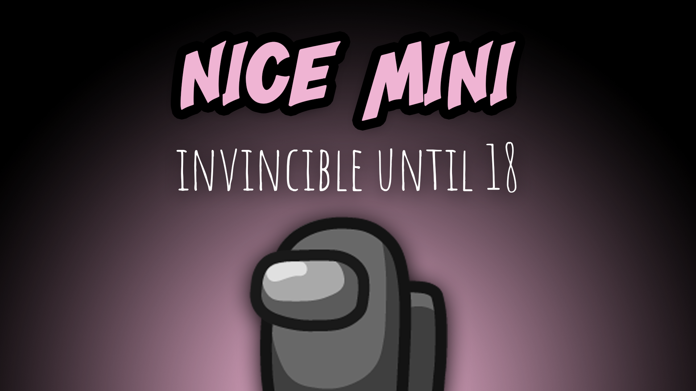
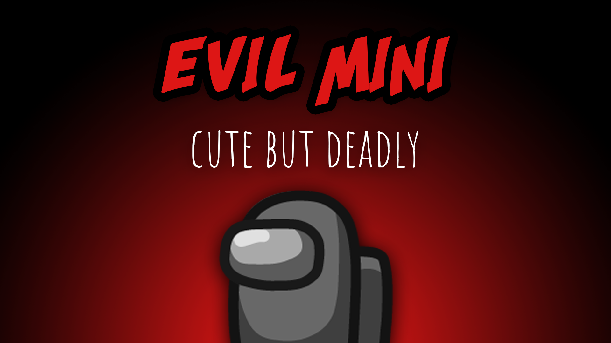

[:arrow_backward: back to overview](https://github.com/laicosvk/theepicroles#roles "back to overview")

# Mini
Cute or not?

The Mini can be a Crewmate (67% chance) or an Impostor (33% chance).
The Mini's character is smaller and hence visible to everyone in the game.
The Mini cannot be killed until it turns 18 years old, however it can be voted out.

## Nice Mini (Crewmate)

- The Crewmate Mini aims to play out the strength its invincibility in the early game.
- If it gets thrown out of the ship before it turns 18, everyone loses. So think twice before you vote out a Mini.

## Evil Mini (Impostor)

- While growing up the kill cooldown is doubled. When it's fully grown up its kill cooldown is 2/3 of the default one.
- If it gets thrown out of the ship, everything is fine.

## Notes
- If the Sheriff tries to kill the Mini before it's fully grown, they die, no matter if the Mini is a Crewmate or Impostor
- The Sheriff can kill the Impostor Mini, but only if it's fully grown up

## Buttons
No special buttons.

## Options
| Name | Default | Description |
| --- | :---: | --- |
| Mini Growing Up Duration | 400 | Time to grow |
| Evil Mini Is Guessable | on | - |
