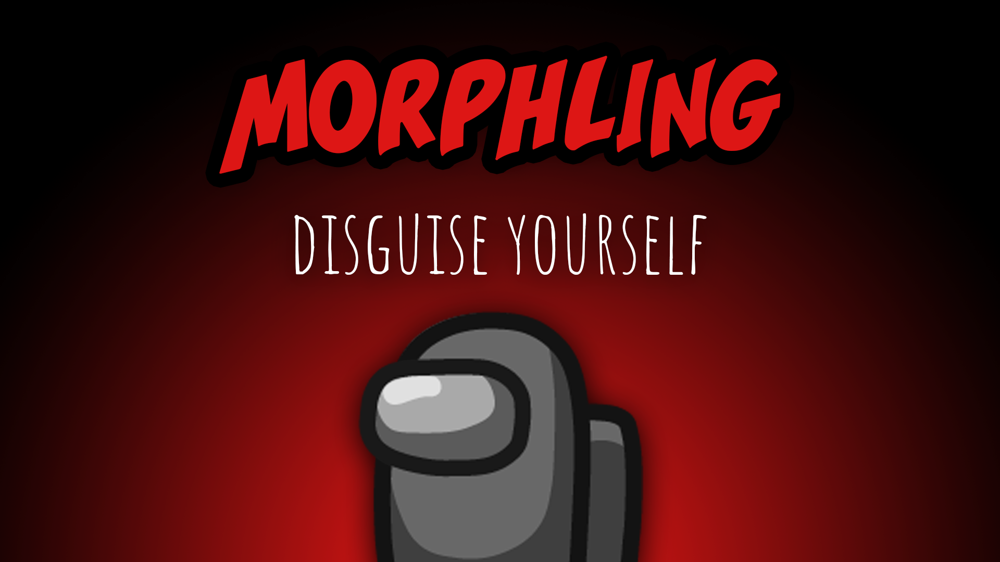

[:arrow_backward: back to overview](https://github.com/laicosvk/theepicroles#roles "back to overview")

# Morphling (Impostor)
Disguise yourself

The Morphling is an Impostor which can additionally scan the appearance of a player. After an arbitrary time they can take on that appearance for 10s.

## Notes
- They shrink to the size of the Mini when they copy its look.
- The Hacker sees the new color on the admin table.
- The color of the footprints changes accordingly (also the ones that were already on the ground).
- The other Impostor still sees that they are an Impostor (the name remains red).
- The shield indicator changes accordingly (the Morphling gains or loses the shield indicator).
- Tracker and Snitch arrows keep working.

## Buttons
| Sample Button | Morph Button |
| :------------: | :------------: |
|  |  |

## Options
| Name | Default | Description |
| --- | :---: | --- |
| Morphling Cooldown | 30 | - |
| Morph Duration | 10 | - |
