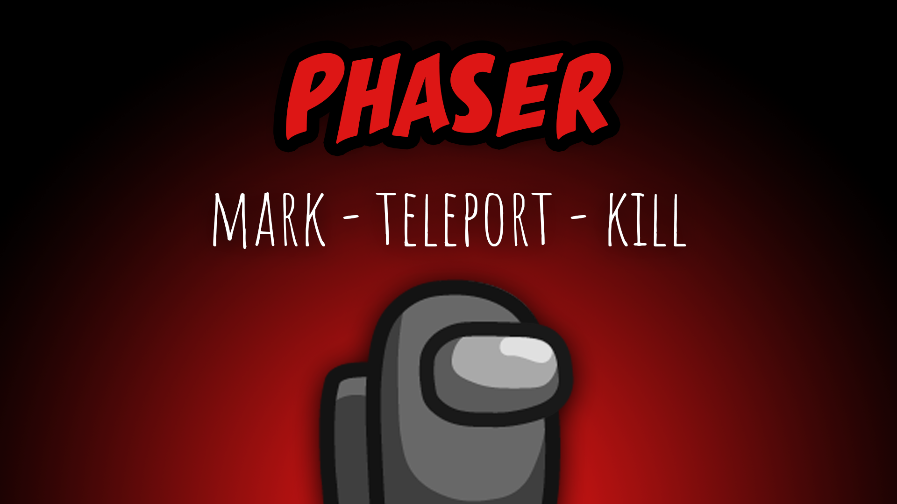

[:arrow_backward: back to overview](https://github.com/laicosvk/theepicroles#roles "back to overview")

# Phaser (Impostor)
Mark - Teleport - Kill

The Phaser has the ability to mark a person after a certain amount of time. After another specified time the Phaser can phase through reality, teleport to his marked person and kill it. This only works if the marked player isn't very close to other players.

## Notes
- The Phase button is disabled if the marked player is close to another player.
- Phaser and Camouflager exclude each others.

## Buttons
| Mark Button | Phase Button |
| :------------: | :------------: |
|  |  |

## Options
| Name | Default | Description |
| --- | :---: | --- |
| Mark Cooldown | 20 | Initial mark cooldown |
| Phase Cooldown | 10 | Phase cooldown after marking |
