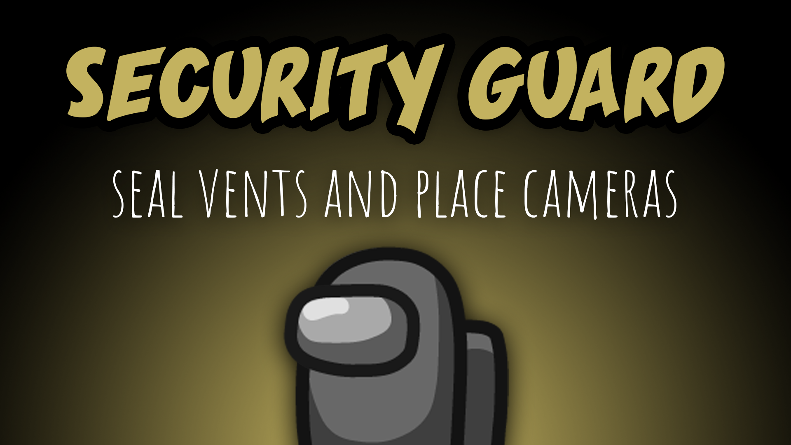

[:arrow_backward: back to overview](https://github.com/laicosvk/theepicroles#roles "back to overview")

# Security Guard (Crewmate)
Seal vents and place cameras

The Security Guard is a Crewmate that has a certain number of screws that they can use for either sealing vents or for placing new cameras.
Placing a new camera and sealing vents takes a configurable amount of screws. The total number of screws that a Security Guard has can also be configured.
The new camera will be visible after the next meeting and accessible by everyone.
The vents will be sealed after the next meeting, players can't enter or exit sealed vents, but they can still "move to them" underground.

## Notes
- Trickster boxes can't be sealed
- The Security Guard can't place cameras on MiraHQ
- The remaining number of screws can be seen above their special button.
- On Skeld the four cameras will be replaced every 3 seconds (with the next four cameras). You can also navigate manually using the arrow keys
- Security Guard can access mobile cameras after placing all screws
- While accessing the mobile cameras, the Security Guard is not able to move

## Buttons
| Seal Button | Camera Button |
| :------------: | :------------: |
|  |  |

## Options
| Name | Default | Description |
| --- | :---: | --- |
| Security Guard Cooldown | 30 | - |
| Number Of Screws | 7 | - |
| Number Of Screws Per Cam | 2 | - |
| Number Of Screws Per Vent | 1 | - |
| Security Guard Duration | 10 | - |
| Gadged Max Charges | 5 | - |
| Number Of Tasks Needed For Recharging | 3 | - |
| Cant Move During Cam Duration | on | - |