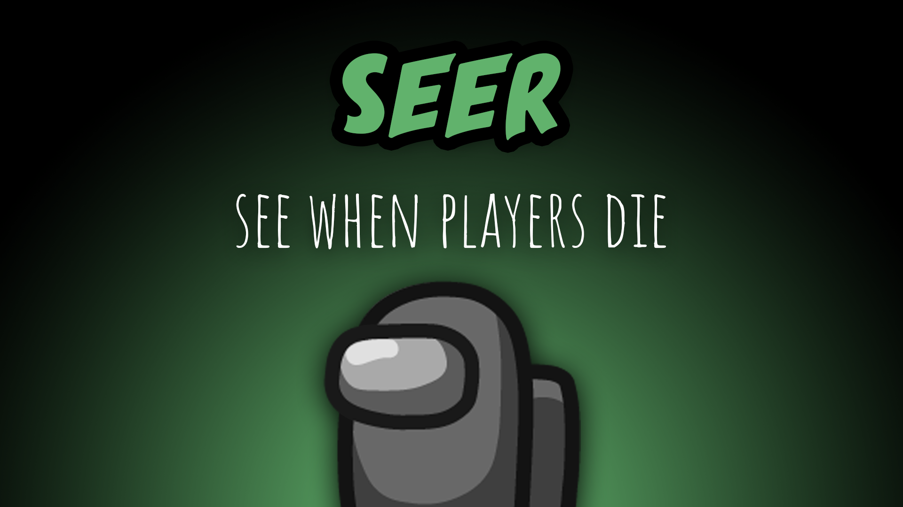

[:arrow_backward: back to overview](https://github.com/laicosvk/theepicroles#roles "back to overview")

# Seer (Crewmate)
See when players die

The Seer has two abilities (one can activate one of them or both in the options). 
The Seer sees the souls of players that died a round earlier, the souls slowly fade away. The Seer gets a blue flash on their screen, if a player dies somewhere on the map.

## Buttons
No special buttons.

## Options
| Name | Default | Description |
| --- | :---: | --- |
| Seer Mode | Show Death Flash + Souls |  |
| Seer Limit Soul Duration | off | - |
| Seer Soul Duration | 15 | - |
