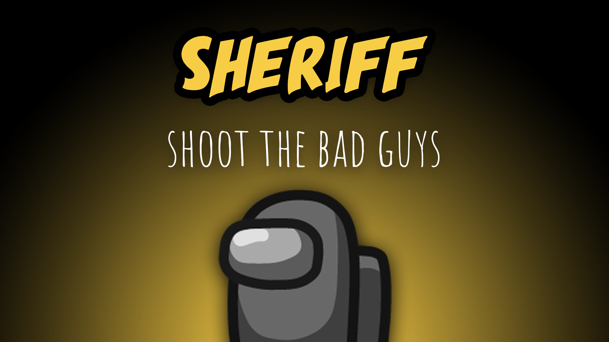

[:arrow_backward: back to overview](https://github.com/laicosvk/theepicroles#roles "back to overview")

# Sheriff (Crewmate)
Shoot the bad guys

The Sheriff has the ability to kill Impostors. If they try to kill a Crewmate, they die instead.

## Notes
- If the Sheriff shoots the person the Medic shielded, the Sheriff and the shielded person both remain unharmed.
- If the Sheriff shoots a Mini Impostor, the Sheriff dies if the Mini is still growing up. If it's 18, the Mini Impostor dies.

## Buttons
No special buttons.

## Options
| Name | Default | Description |
| --- | :---: | --- |
| Sheriff Cooldown | 30 | - |
| Sheriff Can Kill Neutrals| off | - |
| Sheriff Has A Deputy | 0 | Chance for a deputy |