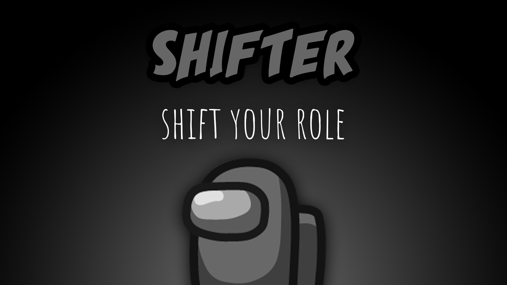

[:arrow_backward: back to overview](https://github.com/laicosvk/theepicroles#roles "back to overview")

# Shifter (Crewmate)
Shift your role

The Shifter can take over the role of another Crewmate, the other player will transform into a Crewmate.
Optionally the other player can transform into a Shifter.
The Shift will always be performed at the end of the next meeting right before a player is exiled. The target needs to be chosen during the round.
Even if the Shifter or the target dies before the meeting, the Shift will still be performed.
Swapping roles with an Impostor or Neutral fails and the Shifter commits suicide after the next meeting (there won't be any body).
The Shifter aims to save roles from leaving the game, by e.g. taking over a Sheriff or Medic that is known to the Impostors.
This works especially well against the Eraser, but also gives the Eraser the possibility to act like a Shifter.

## Notes
- The Shifter shift will always be triggered before the Erase (hence either the new role of the Shifter will be erased or the Shifter saves the role of their target, depending on whom the Eraser erased)
- If the Shifter takes over a role, their new cooldowns will start at the maximum cooldown of the ability
- One time use abilities (e.g. shielding a player or Engineer sabotage fix) can only used by one player in the game (i.e. the Shifter can only use them, if the previous player did not use them before)

## Buttons
| Shift Button | Meeting Bad Shift Icon |
| :------------: | :------------: |
|  |  |

## Options
| Name | Default | Description |
| --- | :---: | --- |
| Shifter Shifts Modifiers | off | Sets if Lovers and/or Medic Shield will be shifted |
| Shifter Shifts Self | off | Shift in both directions |
| Shifter Dies Before Meeting | off | If shifter shifted a bad role |

