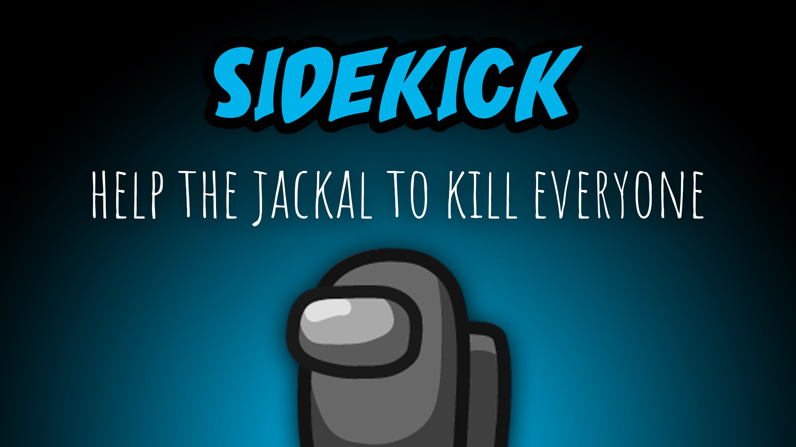

[:arrow_backward: back to overview](https://github.com/laicosvk/theepicroles#roles "back to overview")

# Sidekick (Neutral)
Help the jackal to kill everyone

Gets assigned to a player during the game by the "Create Sidekick Action" of the Jackal and joins the Jackal in their quest to eliminate all other players.
Upon the death of the Jackal (depending on the options), they might get promoted to Jackal themself and potentially even assign a Sidekick of their own.

## Notes
- A player that converts into a Sidekick loses their previous role and tasks (if they had one), except the Lover role.
- The Sidekick may be killed by a Sheriff.
- The Sidekick cannot target the Mini, while it's growing up.

## Buttons
| Sidekick Button |
| :------------: |
|  |

## Options
| Name | Default | Description |
| --- | :---: | --- |
| Sidekick Gets Promoted To Jackal On Jackal Death | off | - |
| Sidekick Can Kill | off | - |
| Sidekick Can Use Vents | on | - |

