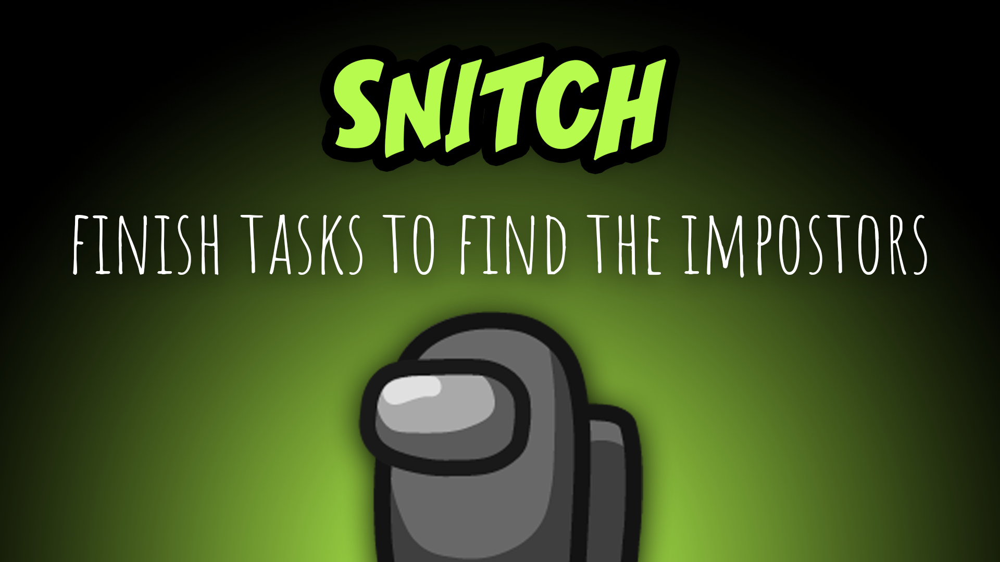

[:arrow_backward: back to overview](https://github.com/laicosvk/theepicroles#roles "back to overview")

# Snitch (Crewmate)
Finish tasks to find the impostors

When the Snitch finishes all the tasks, arrows will appear (only visible to the Snitch) that point to the Impostors (depending on the options also to members of team Jackal). 
When the Snitch has one task left (configurable) the Snitch will be revealed to the Impostors (depending on the options also to members of team Jackal) with an arrow pointing to the Snitch.

## Buttons
No special buttons.

## Options
| Name | Default | Description |
| --- | :---: | --- |
| Task Count Where The Snitch Will Be Revealed | 1 | - |
| Include Team Jackal | off | - |
| Use Different Arrow Color For Team Jackal | on | - |
| Spy Has Impostor Vision | off | - |