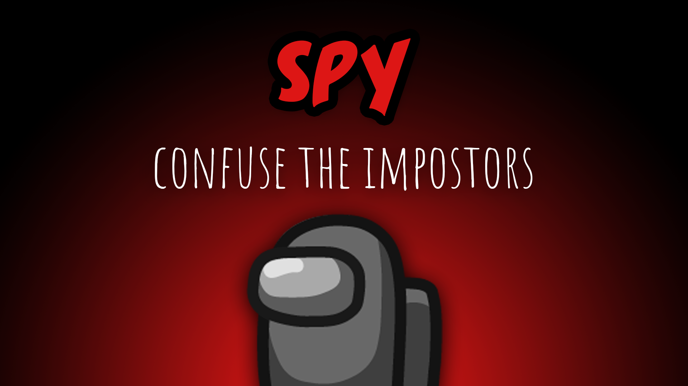

[:arrow_backward: back to overview](https://github.com/laicosvk/theepicroles#roles "back to overview")

# Spy (Crewmate)
Confuse the impostors

The Spy is a Crewmate, which has no special abilities.
The Spy looks like an additional Impostor to the Impostors, they can't tell the difference.

There are two possibilities (depending on the set options):
- The Impostors can't kill the Spy (because otherwise their kill button would reveal, who the Spy is)
- The Impostors can kill the Spy but they can also kill their Impostor partner (if they mistake another Impostor for the Spy) You can set whether the Sheriff can kill the Spy or not (in order to keep the lie alive).

## Buttons
No special buttons.

## Options
| Name | Default | Description |
| --- | :---: | --- |
| Spy Can Die To Sheriff | off | - |
| Impostors Can Kill Anyone If There Is A Spy | on | - |
| Spy Can Enter Vents | off | - |
| Spy Has Impostor Vision | off | - |