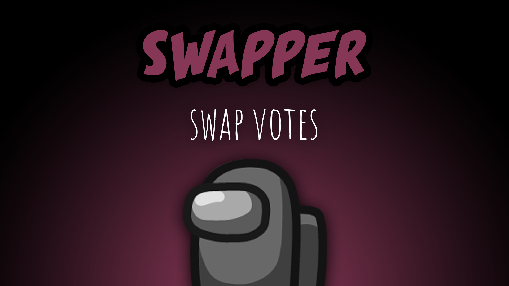

[:arrow_backward: back to overview](https://github.com/laicosvk/theepicroles#roles "back to overview")

# Swapper (Crewmate)
Swap votes

During meetings the Swapper can exchange votes that two people get (i.e. all votes that player A got will be given to player B and vice versa).
Because of the Swapper's strength in meetings, they might not start emergency meetings and can't fix lights and comms.llbound players will die before the voted player dies (which might trigger e.g. trigger an Impostor win condition, even if the Witch is the one being voted)

## Buttons
| Meeting Swap Button |
| :------------: |
|  |

## Options
| Name | Default | Description |
| --- | :---: | --- |
| Swapper Can Call Emergency Meeting | off | - |
| Swapper Can Only Swap Others | off | - |