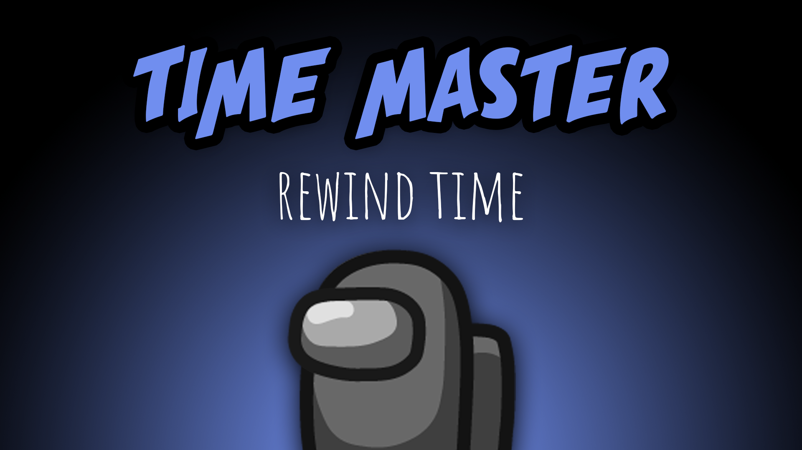

[:arrow_backward: back to overview](https://github.com/laicosvk/theepicroles#roles "back to overview")

# Time Master (Crewmate)
Rewind time

The Time Master has a time shield which they can activate. The time shield remains active for a configurable amount of time.
If a player tries to kill the Time Master while the time shield is active, the kill won't happen and the time will rewind for a set amount of time.
The kill cooldown of the killer won't be reset, so the Time Master has to make sure that the game won't result in the same situation.
The Time Master won't be affected by the rewind.

## Notes
- Only the movement is affected by the rewind.
- A Vampire bite will trigger the rewind. If the Time Master misses shielding the bite, they can still shield the kill which happens a few seconds later.
- If the Time Master was bitten and has their shield active before when a meeting is called, they survive but the time won't be rewound.
- If the Time Master has a Medic shield, they won't rewind.
- The shield itself ends immediately when triggered. So the Time Master can be attacked again as soon as the rewind ends.

## Buttons
| Time Shield Button |
| :------------: |
|  |

## Options
| Name | Default | Description |
| --- | :---: | --- |
| Time Master Cooldown | 30 | - |
| Rewind Time | 3 | - |
| Time Master Shield Duration | 3 | - |