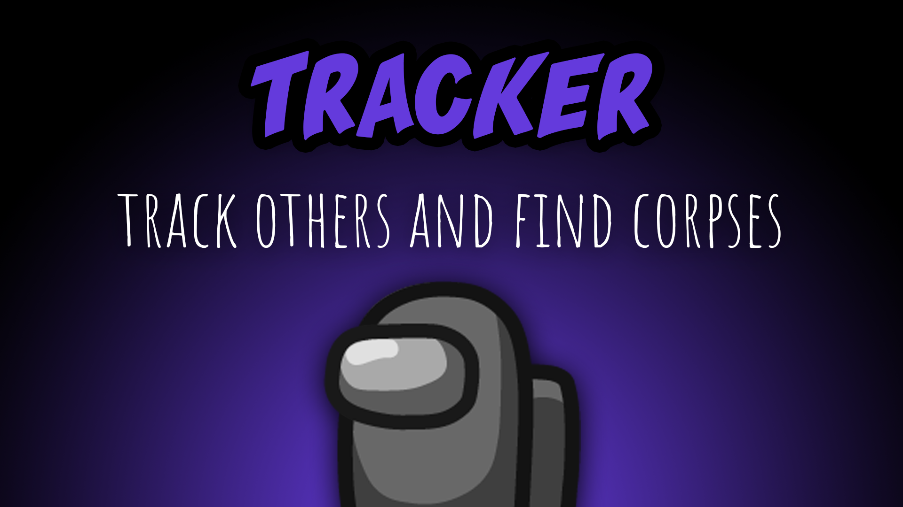

[:arrow_backward: back to overview](https://github.com/laicosvk/theepicroles#roles "back to overview")

# Tracker (Crewmate)
Track others and find corpses

The Tracker can select one player to track. Depending on the options the Tracker can track a different person after each meeting or the Tracker tracks the same person for the whole game.
An arrow points to the last tracked position of the player. The arrow updates its position every few seconds (configurable). 
Depending on the options, the Tracker has another ability: They can track all corpses on the map for a set amount of time. They will keep tracking corpses, even if they were cleaned or eaten by the Vulture.

## Buttons
| Track Button | Find Button |
| :------------: | :------------: |
|  |  |

## Options
| Name | Default | Description |
| --- | :---: | --- |
| Tracker Update Intervall | 5 | - |
| Tracker Reset Target After Meeting | off | - |
| Tracker Can Track Corpses | on | - |
| Corpses Tracking Cooldown | 30 | - |
| Corpses Tracking Duration | 5 | - |