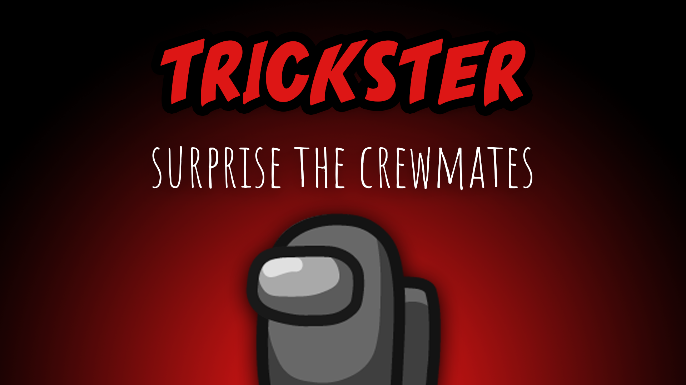

[:arrow_backward: back to overview](https://github.com/laicosvk/theepicroles#roles "back to overview")

# Trickster (Impostor)
Surprise the crewmates

The Trickster is an Impostor that can place 3 jack-in-the-boxes that are invisible at first to other players.
If the Trickster has placed all of their boxes they will be converted into a vent network usable only by the Trickster themself, but the boxes are revealed to the others.
If the boxes are converted to a vent network, the Trickster gains a new ability "Lights out" to limit the visibility of Non-Impostors, that cannot be fixed by other players. Lights are automatically restored after a while.

## Notes
- Impostors will get a text indicator at the bottom of the screen to notify them if the lights are out due to the Trickster ability, as there is no sabotage arrows or task to sabotage text to otherwise notify them about it.

## Buttons
| Trickster Vent Button | Trickster Light Button |
| :------------: | :------------: |
|  |  |

## Options
| Name | Default | Description |
| --- | :---: | --- |
| Trickster Box Cooldown | 10 | Cooldown for placing boxes |
| Trickster Box Count | 3 | - |
| Trickster Lights Out Cooldown | 30 | - |
| Trickster Lights Out Duration | 15 | - |