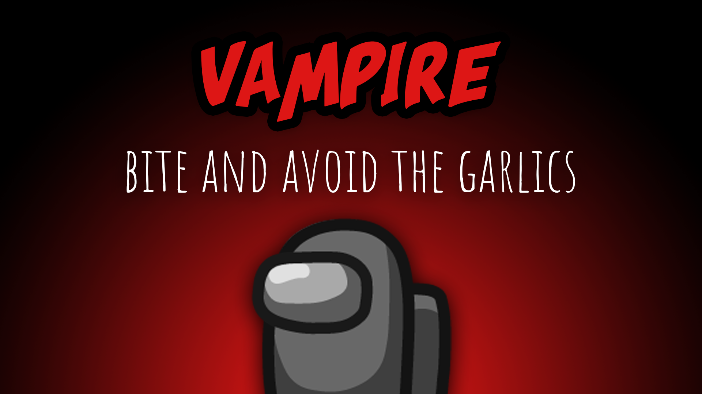

[:arrow_backward: back to overview](https://github.com/laicosvk/theepicroles#roles "back to overview")

# Vampire (Impostor)
Bite and avoid the garlics

The Vampire is an Impostor, that can bite other player. Bitten players die after a configurable amount of time.
If the Vampire spawn chance is greater 0 (even if there is no Vampire in the game), all players can place one garlic.
If a victim is near a garlic, the "Bite Button" turns into the default "Kill Button" and the Vampire can only perform a normal kill.

## Notes
- If a bitten player is still alive when a meeting is being called, they die at the start of the meeting.
- The cooldown is the same as the default kill cooldown (+ the kill delay if the Vampire bites the target).
- If there is a Vampire in the game, there can't be a Warlock.

## Buttons
| Bite Button | Garlic Button |
| :------------: | :------------: |
|  |  |

## Options
| Name | Default | Description |
| --- | :---: | --- |
| Vampire Cooldown | 30 | - |
| Vampire Kill Delay | 10 | - |
| Vampire Can Kill Near Garlics | on | Biting is always disabled in garlics |