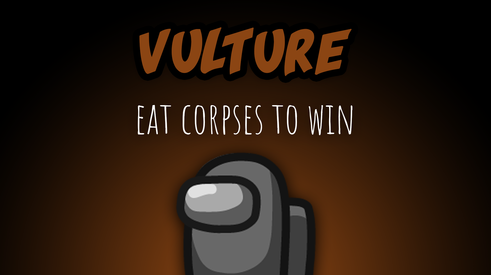

[:arrow_backward: back to overview](https://github.com/laicosvk/theepicroles#roles "back to overview")

# Vulture (Neutral)
Eat corpses to win

The Vulture does not have any tasks, they have to win the game as a solo.
The Vulture is a neutral role that must eat a specified number of corpses (depending on the options) in order to win.
Depending on the options, when a player dies, the Vulture gets an arrow pointing to the corpse. If there is a Vulture in the game, there can't be a Cleaner.

## Buttons
| Eat Button |
| :------------: |
|  |

## Options
| Name | Default | Description |
| --- | :---: | --- |
| Vulture Cooldown | 15 | - |
| Number Of Corpses Needed To Be Eaten | 4 | - |
| Vulture Can Use Vents | on | - |
| Show Arrows Pointing Towards The Corpses | on | - |