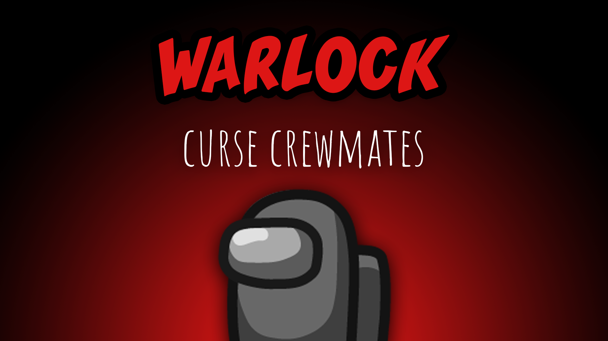

[:arrow_backward: back to overview](https://github.com/laicosvk/theepicroles#roles "back to overview")

# Warlock (Impostor)
Curse crewmates

The Warlock is an Impostor, that can curse another player (the cursed player doesn't get notified).
If the cursed person stands next to another player, the Warlock is able to kill that player (no matter how far away they are).
Performing a kill with the help of a cursed player, will lift the curse and it will result in the Warlock being unable to move for a configurable amount of time.
The Warlock can still perform normal kills, but the two buttons share the same cooldown.

## Notes
- The Warlock can always kill their Impostor mates (and even themself) using the "cursed kill"
- If there is a Warlock in the game, there can't be a Vampire
- Performing a normal kill, doesn't lift the curse

## Buttons
| Curse Button | Curse Kill Button |
| :------------: | :------------: |
|  |  |

## Options
| Name | Default | Description |
| --- | :---: | --- |
| Warlock Cooldown | 30 | - |
| Warlock Root Time | 5 | The amount of time the warlock is rooted after a curse kill |